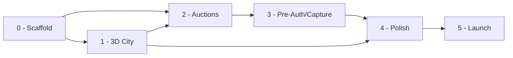

# SaaSity — Milestone Plans

Roadmap for **SaaSity**: a 10x10 isometric cyberpunk city where SaaS founders bid in recurring timed auctions for a time-limited lease on a billboard plot — not a one-time purchase. Every plot cycles forever: claim it idle at the tier floor price, defend it against challengers (live or via eBay-style proxy max-bids), hold it for the tier's lease duration, then the next cycle opens fresh at the floor price again.

> **Grid:** unchanged from the original spec — 36 Outer (1x1) + 12 Mid (2x2) + 1 Core (4x4) = 49 plots, 100 cells, zero gaps/overlaps
> **Per-cycle floor economics (worst case, zero contested bids, recurs every cycle):** 36 x $1.00 (Outer, 6h) + 12 x $5.00 (Mid, 12h) + 1 x $25.00 (Core, 24h) = **$121 / full rotation**, uncapped upside from live bidding wars — replaces the old one-time $3,831 ceiling with recurring, floor-bounded-below revenue
> **Estimated effort:** ~31–34 working days, finalized by summing all 25 phase files' `**Estimate:**` lines (M0 2.5d + M1 7–8d + M2 8.5–9d + M3 5.5d + M4 4.5–5d + M5 3–3.5d) — up from the original ~21–24.5 day one-time-sale estimate; the auction/proxy-bid/pre-auth engine plus the terraced hill & identification system add ~1–1.5d to M1 alone

## Navigation

| # | Milestone | Plan | Status |
|---|-----------|------|--------|
| 0 | Scaffold & Data Layer | [00-scaffold-and-data-layer/PLAN.md](00-scaffold-and-data-layer/PLAN.md) | 🟡 In progress (implemented + locally verified; Vercel deploy boxes open) |
| 1 | 3D City | [01-3d-city/PLAN.md](01-3d-city/PLAN.md) | 🟡 In progress (shipped + remediation hardening; preview/real-device proof pending) |
| 2 | Auctions & Realtime | [02-reservations-and-realtime/PLAN.md](02-reservations-and-realtime/PLAN.md) | 🟡 In progress (2.1–2.5 implemented + locally verified; preview proof pending) |
| 3 | Stripe Pre-Auth & Capture | [03-stripe-payments/PLAN.md](03-stripe-payments/PLAN.md) | 🔴 Blocked (Parts 1–4 gate — see remediation pack) |
| 4 | Landing & Polish | [04-landing-and-polish/PLAN.md](04-landing-and-polish/PLAN.md) | ⚪ Not started |
| 5 | Launch & Operations | [05-launch-and-operations/PLAN.md](05-launch-and-operations/PLAN.md) | ⚪ Not started |

**Status legend:** ⚪ Not started · 🟡 In progress · 🟢 Done · 🔴 Blocked

**Verification states (Part 7 `status-governance-drift`):** a phase marked
Done means *implemented + locally verified* (unit suite, `tsc`, `next build`,
proof scripts against a local prod-mode server) unless its evidence note says
otherwise. *Preview verified* and *production verified* are separate states —
no M0–M2 phase claims either yet (no deployment exists; see
[Part 7](../reviews/m0-m2-remediation/part-07-testing-release-documentation.md)).
Boxes stay open until the evidence they name exists, even inside otherwise-Done
phases.

**Note on folder names:** milestone folders (`02-reservations-and-realtime`, `03-stripe-payments`) keep their original slugs to avoid renumbering every cross-file link; only their *content and displayed titles* changed to the auction/lease model. Treat `02-reservations-and-realtime` as "Auctions & Realtime" and `03-stripe-payments` as "Stripe Pre-Auth & Capture" throughout.

## Dependency flow



## Folder conventions

```
docs/plans/
└── NN-milestone-name/
    ├── PLAN.md                     <- milestone overview (scope, phases, DoD)
    └── phases/
        └── phase-NN-name.md        <- detailed step-by-step phase plans
```

- Milestone folders are zero-padded and kebab-cased (`02-reservations-and-realtime`).
- Each phase file lives in the milestone's `phases/` folder, named `phase-01-slug.md`, `phase-02-slug.md`, … in execution order, and is linked from its milestone's *Planned phases* table.
- Each phase file follows one template: **Goal → Prerequisites → Steps → Verification → Exit criteria → Out of scope**, with prev/next navigation in the header.
- Update the status table above whenever a milestone changes state; flip per-file `**Status:**` lines as phases progress.
